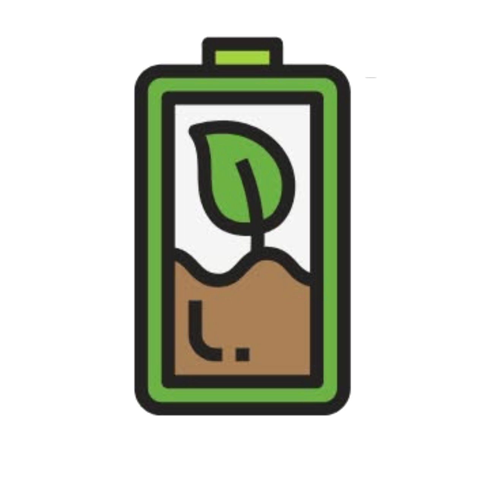

<div align="center">



# Renewable Ireland

**Ireland's Solar Panel Installation Platform**

[](https://nextjs.org/)
[](https://www.typescriptlang.org/)
[](https://tailwindcss.com/)
[](https://ui.shadcn.com/)
[](https://prisma.io/)
[]()

[🌐 Live Site](https://renewableireland.ie) · [📋 County Sites](#county-microsites) · [🤖 AI Chat](#features) · [📞 Get a Quote](https://renewableireland.ie)

</div>

---

## Overview

Renewable Ireland is a full-stack web platform for Ireland's trusted solar panel installation company. Built with Next.js 16, it serves as both the main company website and a scalable multi-county microsite generator covering all 32 counties across the Republic of Ireland and Northern Ireland.

The platform features an AI-powered solar assistant (SolarBot), dynamic SEO-optimised county pages, ROI calculators, referral programme, lead qualification system, and a neo-brutalist design system.

## Tech Stack

| Layer | Technology |
|-------|-----------|
| **Framework** | Next.js 16 (App Router, Turbopack) |
| **Language** | TypeScript 5 |
| **Styling** | Tailwind CSS 4 + CSS Modules |
| **UI Components** | shadcn/ui + Radix primitives |
| **Database** | SQLite + Prisma ORM 6 |
| **AI** | z-ai-web-dev-sdk (SolarBot chat assistant) |
| **Animations** | Framer Motion 12 |
| **Forms** | React Hook Form + Zod validation |
| **State** | Zustand 5 |
| **Runtime** | Bun / Node.js |
| **Deployment** | Standalone output (Docker-ready) |

## Architecture

```
renewableireland/
├── src/
│   ├── app/                          # Next.js App Router
│   │   ├── layout.tsx                # Root layout with JSON-LD schemas
│   │   ├── global-error.tsx          # Global error boundary
│   │   ├── loading.tsx               # Loading state
│   │   ├── sitemap.ts                # Dynamic XML sitemap (counties/services)
│   │   ├── roi-calculator/           # Interactive ROI calculator
│   │   ├── referral/                 # Referral programme with unique codes
│   │   ├── counties/[county]/
│   │   │   ├── page.tsx              # County landing page (32 counties)
│   │   │   ├── [service]/            # Service sub-pages
│   │   │   ├── blog/[slug]/          # SEO blog with dynamic slugs
│   │   │   ├── terms/                # Auto-generated terms per county
│   │   │   └── privacy-policy/
│   │   └── api/
│   │       ├── chat/route.ts         # SolarBot AI chat endpoint
│   │       ├── chat/lead/            # Lead capture from chat
│   │       ├── chat/book-survey/     # Survey booking
│   │       ├── lead/qualify/         # Lead qualification API
│   │       ├── roi-certificate/      # ROI certificate generator
│   │       ├── referral/route.ts     # Referral code management
│   │       └── exit-intent/          # Exit intent lead magnet + dismiss
│   ├── components/
│   │   ├── ui/                       # 48 shadcn/ui components
│   │   ├── chat/                     # AI chat widget (SolarBot)
│   │   ├── county/                   # Hero, Nav, FAQ, Services, etc.
│   │   ├── exit-intent/              # Exit intent popup overlay
│   │   ├── lead/                     # Lead capture & qualification flow
│   │   ├── roi/                      # ROI certificate component
│   │   ├── whatsapp/                 # WhatsApp chat widget
│   │   └── v8-script-loader.tsx      # Homepage script loader
│   ├── data/
│   │   ├── counties.ts               # 32 county data + services + FAQs
│   │   └── blog-posts.ts             # SEO blog content
│   ├── hooks/                        # use-mobile, use-toast
│   └── lib/
│       ├── utils.ts                  # General helpers (cn, etc.)
│       ├── db.ts                     # Database client
│       ├── eircode.ts                # Eircode validation
│       ├── jsonld.ts                 # JSON-LD schema generation
│       ├── savings-calculator.ts     # ROI calculations
│       └── v8-body-content.ts        # Homepage HTML content
├── prisma/
│   └── schema.prisma                 # SQLite database schema (User, Post)
├── public/
│   ├── favicon.ico                 # Multi-size ICO favicon
│   ├── favicon.svg                 # SVG favicon (embedded PNG)
│   ├── favicon.png                 # PNG favicon (32x32)
│   ├── favicon-16x16.png           # PNG favicon (16x16)
│   ├── favicon-32x32.png           # PNG favicon (32x32)
│   ├── v8-homepage.html            # Standalone homepage (served at /)
│   ├── robots.txt                  # Search engine crawling rules
│   └── images/
│       ├── logo.png                # Company logo (transparent PNG)
│       ├── apple-touch-icon.png    # iOS homescreen icon (180x180)
│       ├── favicon-16x16.png       # Favicon for browsers
│       ├── favicon-32x32.png       # Favicon for browsers
│       ├── favicon-192x192.png     # Android Chrome icon
│       └── hero-solar.webp         # Hero section background image
├── next.config.ts                    # Next.js config (standalone output, rewrites)
├── tailwind.config.ts                # Tailwind CSS configuration
├── components.json                   # shadcn/ui component configuration
├── package.json                      # Dependencies and scripts
├── bun.lock / package-lock.json      # Lockfiles
└── .env.example                      # Environment variable template
```

## Features

### 🏠 Homepage
- Standalone HTML with neo-brutalist design system
- Full-width hero, trust signals, FAQ accordion, county selector
- SEAI grant information and pricing tables
- Mobile-first responsive layout

### 🤖 SolarBot AI Assistant
- Real-time conversational AI for solar enquiries
- SEAI grant eligibility checks
- System sizing recommendations
- Survey booking integration
- Rate-limited (20 messages per 15-minute window)

### 📍 County Microsites
- **32 county-specific landing pages** with unique domains
- Localised content, testimonials, and FAQs per county
- Dynamic accent colour theming per county
- Auto-generated terms of service and privacy policies
- SEO-optimised with county-specific meta tags and JSON-LD

### 📊 ROI Calculator
- Interactive savings calculator
- System size, electricity costs, and export rate inputs
- Annual/25-year ROI projections
- Downloadable ROI certificate (PDF)

### 🔗 Referral Programme
- Unique referral codes per customer
- Customisable referral landing pages
- Referral tracking dashboard

### 📝 SEO Blog
- 32+ county-specific blog articles
- Dynamic slugs and structured data
- Auto-generated from content data files

### 📋 Lead Management
- Multi-step lead qualification forms
- Exit intent lead magnet capture
- AI-powered lead qualification API
- Survey booking integration

## County Microsites

The platform generates landing pages for all 32 Irish counties:

| Republic of Ireland | Northern Ireland |
|---------------------|-------------------|
| renewablecarlow.ie | renewablertyrone.ie |
| renewablecavan.ie | renewableantrim.ie |
| renewableclare.ie | renewablearmagh.ie |
| renewablecork.ie | renewabledown.ie |
| renewabledonegal.ie | renewablefermanagh.ie |
| renewabledublin.ie | renewablelondonderry.ie |
| ...and 19 more | |

Each county site includes localised testimonials, service pages, blog content, terms, and privacy policies.

## Getting Started

### Prerequisites

- Node.js 18+ or [Bun](https://bun.sh/)
- npm, yarn, or bun

### Installation

```bash
# Clone the repository
git clone https://github.com/RenewableIreland/RenewableIreland.git
cd RenewableIreland

# Install dependencies
bun install
# or: npm install

# Set up environment variables
cp .env.example .env.local
# Edit .env.local with your values

# Push database schema
bun run db:push

# Start development server
bun run dev
```

The site will be available at [http://localhost:3000](http://localhost:3000).

### Environment Variables

| Variable | Description | Required |
|----------|-------------|----------|
| `DATABASE_URL` | SQLite database path | Yes |
| `Z_AI_BASE_URL` | AI service base URL (SolarBot chat) | For chat |
| `Z_AI_API_KEY` | AI service API key | For chat |
| `NEXT_PUBLIC_SITE_URL` | Canonical site URL (sitemap, OG) | Yes |

## Available Scripts

| Command | Description |
|---------|-------------|
| `bun run dev` | Start development server (port 3000) |
| `bun run build` | Production build with standalone output |
| `bun run start` | Start production server |
| `bun run lint` | Run ESLint |
| `bun run db:push` | Push Prisma schema to database |
| `bun run db:generate` | Generate Prisma client |
| `bun run db:migrate` | Run database migrations |

## SEO & Performance

- **JSON-LD structured data**: Organization, LocalBusiness, WebSite, BreadcrumbList
- **Dynamic XML sitemap**: All county pages, service pages, and blog posts
- **robots.txt**: Search engine crawling configuration
- **Open Graph & Twitter Cards**: Full social sharing metadata
- **Stand-alone output**: Docker-ready with minimal container size

## Deployment

The project uses Next.js standalone output for optimal Docker deployment:

```dockerfile
FROM node:20-alpine AS base
FROM base AS deps
WORKDIR /app
COPY package.json bun.lockb* ./
RUN bun install --frozen-lockfile

FROM base AS builder
WORKDIR /app
COPY --from=deps /app/node_modules ./node_modules
COPY . .
RUN bun run build

FROM base AS runner
WORKDIR /app
ENV NODE_ENV=production
COPY --from=builder /app/.next/standalone ./
COPY --from=builder /app/.next/static ./.next/static
COPY --from=builder /app/public ./public
EXPOSE 3000
CMD ["node", "server.js"]
```

## Contributing

This is a private commercial project. For contribution guidelines, please contact the development team at [hello@renewableireland.ie](mailto:hello@renewableireland.ie).

## Contact

- **Website**: [renewableireland.ie](https://renewableireland.ie)
- **Email**: hello@renewableireland.ie
- **Phone**: +353 87 395 8424
- **Location**: Unit 12, Sandyford Business Centre, Dublin 18, D18 A4K9, Ireland

---

<div align="center">

**Built for a greener Ireland**

© 2024–2026 Renewable Ireland. All rights reserved.

</div>
